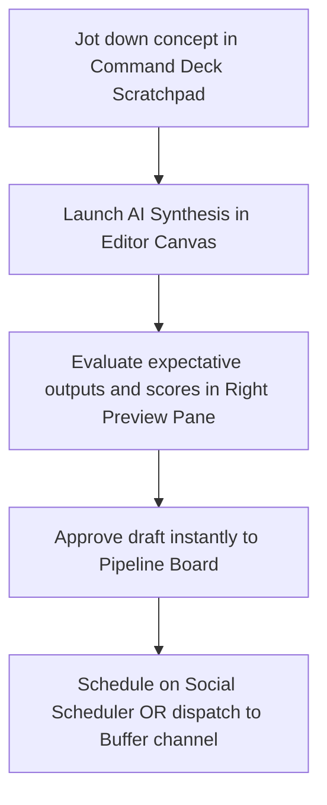
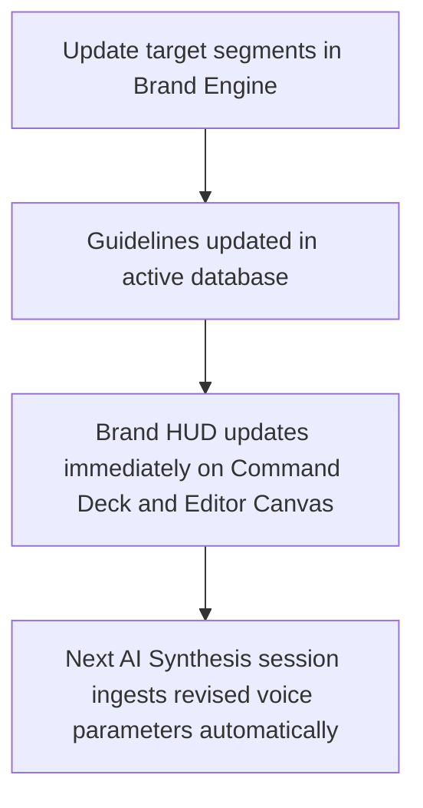

# Global Product Navigation Architecture

This document defines the single, unified application shell and global navigation architecture for the Content Operating System, ensuring absolute design and structural consistency across all pages.

---

## 1. Product Hierarchy & Information Architecture

The system is structured into three primary layout layers to eliminate inconsistencies between workspaces, editing canvases, and settings dashboards.

```
[Level 0: Global App Shell Wrapper]
  │
  ├── [Level 1: Global Sidebar (Fixed Left, 256px)]
  │     ├── Workspace Context Switcher (Notion-style selector)
  │     ├── Main Operations (Command Deck, Editor Canvas, Pipeline Board, Scheduler)
  │     ├── Core Guidelines (Brand Engine)
  │     └── Workspace Configurations (API Vault / Channels, User Settings)
  │
  └── [Level 2: Main Application Context (Scrollable, Flex-1)]
        ├── Global Top Banner (Search, Sync Status, Help Hub, Identity Indicator)
        └── Dynamic Route Canvas (The viewport where page-specific contents render)
```

---

## 2. Global Navigation Map & Route Tree

All paths follow a flat, highly structured routing tree mapping to standard Next.js workspace routes:

```
/ (Root)
 ├── /                   --> [Command Deck] (Unified overview, scratchpad, active task columns)
 ├── /generate           --> [Editor Canvas] (High-density multi-pane AI content synthesis workspace)
 ├── /drafts             --> [Pipeline Board] (Multi-column content review, approval & publishing cards)
 ├── /calendar           --> [Social Scheduler] (Visual publishing slot layout calendar)
 ├── /profile            --> [Brand Engine] (Voice metrics, target personas guidelines HUD)
 └── /settings           --> [Publishing Channels] (API vaults for OpenAI, Buffer, and account settings)
```

---

## 3. Global Sidebar Layout Structure

The final sidebar maintains consistent design parameters (icons, typographies, click areas, states) across all sessions.

```
+----------------------------------------+
| [C] Content OS Studio         (v)      |  <-- Notion-style Workspace Dropdown Header
| Production Workspace                   |
+----------------------------------------+
|                                        |
|  OPERATIONS                            |  <-- Section Title (Uppercase, 9px, Tracking 0.18em)
|  [⚡] Command Deck                      |  <-- Active state: bg-slate-150 / dark:bg-slate-800
|  [🎨] Editor Canvas                    |  <-- Hover state: bg-slate-150/40
|  [📋] Pipeline Board                   |
|  [📅] Social Scheduler                 |
|                                        |
|  GUIDELINES                            |
|  [🎯] Brand Engine                     |  <-- Consistent size (14px icons), clean semi-bold fonts
|                                        |
|  CONFIGURATIONS                        |
|  [🔌] Publishing Channels              |
|                                        |
+----------------------------------------+
| (•) Content Pipeline Live        [OWN] |  <-- Connection Health Status + Mode Indicator
+----------------------------------------+
```

---

## 4. User flows & Operational Journeys

### Journey 1: Concept to Social Feed Dispatch


### Journey 2: Brand Voice Refinement


---

## 5. SaaS Navigation Standards

1. **No Mixed Shells**: No page may implement its own sidebar or top-level navigation panel. The global left sidebar remains fixed at `w-64` (`256px`) across all pages.
2. **Fixed Viewports**: The overall application page scroll is disabled via `h-screen overflow-hidden` on the layout wrapper. Page sub-sections must declare their own scrolling areas (`overflow-y-auto`) to avoid inconsistent page heights.
3. **Identical Design Tokens**: Consistent active/hover navigation selectors must map exactly to variables defined in `globals.css` and `src/components/layout/sidebar.tsx`.
