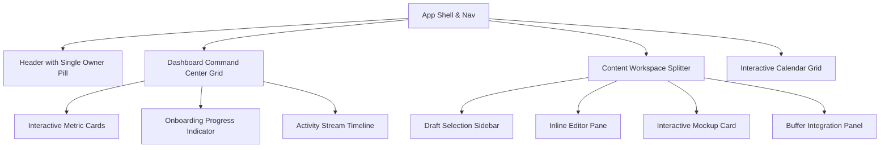

# Premium UX Redesign Specification

**Prepared by**: Senior SaaS Product Designer, SaaS UX Architect, Growth Product Lead  
**Target Product**: AI Content Publisher SaaS  
**Design Reference Style**: Notion (Minimalist typography), Linear (Sleek dark-borders & micro-contrast), Buffer (Publishing simplicity), Beehiiv (Premium content editor workflows)

---

## 🎨 1. Premium SaaS Design System

To transition the product from a developer-focused utility to a premium enterprise-grade content workstation, we define a unified design system. We discard standard raw primary colors (e.g., pure blue, pure green) and establish an HSL-anchored palette.

```
┌──────────────────────────────────────────────────────────┐
│                    DESIGN TOKEN SYSTEM                   │
├───────────────┬───────────────────────────┬──────────────┤
│ Token Class   │ CSS Variables (HSL)       │ Sample Hex   │
├───────────────┼───────────────────────────┼──────────────┤
│ Background    │ 210 20% 98% (Alabaster)   │ #F8F9FA      │
│ Surface       │ 0 0% 100% (Pure White)    │ #FFFFFF      │
│ Border        │ 214 32% 91% (Soft Gray)   │ #E2E8F0      │
│ Primary       │ 250 89% 60% (Violet-Core) │ #6366F1      │
│ Secondary     │ 262 80% 50% (Royal Silk)  │ #7C3AED      │
│ Text Core     │ 222 47% 11% (Slate Ink)   │ #0F172A      │
│ Success (Pill)│ 160 84% 39% (Mint Glow)   │ #10B981      │
└───────────────┴───────────────────────────┴──────────────┘
```

### Typography (Google Fonts Integration)
*   **Headings**: `Outfit` — A clean, geometric sans-serif that gives a modern, premium SaaS feel.
*   **Body / Code / Metadata**: `Inter` — Highly legible, neutral sans-serif designed for UI screens.

### Micro-Animations & Transitions
*   **Hover states**: `transition: all 0.2s cubic-bezier(0.16, 1, 0.3, 1)` (Ultra-smooth spring curves).
*   **Loading states**: Soft ambient glow cycles (shimmer effects) instead of raw spinning circles.

---

## 🔍 2. UX Audit: Current vs. Premium SaaS Patterns

| Page / Element | Current "Developer-Style" UI | Premium SaaS Target (Redesigned) |
| :--- | :--- | :--- |
| **Dashboard Home** | Simple statistical cards, plain list table for logs. | **Command Center Layout**: High-impact metrics, quick-action tiles, inline onboarding wizard progress, and analytics trend graphs. |
| **Generate Wizard** | Standard wizard cards, select dropdowns, linear step blockers. | **Interactive Prompt Canvas**: Slide-out brand context visualizer, side-by-side prompt tuning, and real-time generation timeline stages. |
| **Draft Review** | Default list-view panel, basic preview, small editor form modal. | **Live Mockup Workspace**: Notion-style editor inline, responsive side-by-side multi-platform (Facebook, LinkedIn) mock preview, bulk-action floating actions. |
| **Calendar** | Static placeholder message. | **Publishing Schedule Grid**: Dynamic drag-and-drop interactive calendar mockup visualizing content slots, buffer synchronization status, and visual post cards. |
| **Brand Profile** | Plain form fields, textareas without context cues. | **Voice & Persona Matrix**: Quadrant personality sliders, target profile generation card, and tone of voice presets. |
| **Settings** | Basic API forms, standard inputs with masked fields. | **BYOK Secure Vault**: Clean encryption badges, active visibility toggle controls, and live latency/status ping indicator. |

---

## 📐 3. Wireframes & High-Fidelity Specs (Markdown Mockups)

### 📊 A. Dashboard Home (Command Center)

The dashboard is structured using a **3-column layout** focusing on immediate actions.

```
+-----------------------------------------------------------------------------------+
|  [Logo] Content OS   (Overview) (Content) (Settings)         [Single Owner Mode]  |
+-----------------------------------------------------------------------------------+
|  Welcome back, Owner!                                                             |
|  Here is your content operation center for today.                                 |
|                                                                                   |
|  +---------------------------+  +──────────────────────────────────────────────+  |
|  |  ONBOARDING (60%)         |  | METRICS AT A GLANCE                          |  |
|  |  [||||||||||||      ]     |  | +------------+ +------------+ +------------+ |  |
|  |                           |  | | Gen Count  | | Queue Size | | Live Posts | |  |
|  |  1. Brand Profile   [x]   |  | | 125 posts  | | 12 queued  | | 42 posts   | |  |
|  |  2. OpenAI Config   [x]   |  | +------------+ +------------+ +------------+ |  |
|  |  3. Connect Buffer  [ ]   |  +──────────────────────────────────────────────+  |
|  |  4. Generate First  [ ]   |                                                    |
|  |  5. Publish First   [ ]   |  +──────────────────────────────────────────────+  |
|  |                           |  | ACTIVITY FEED                                |  |
|  |  [Continue Setup ->]      |  | - 12:40 PM: Post "PDPA Guide" published      |  |
|  +---------------------------+  | - 10:15 AM: 5 Drafts generated              |  |
|                                 +──────────────────────────────────────────────+  |
+-----------------------------------------------------------------------------------+
```

---

### 🎨 B. Live Mockup Workspace (Draft Review)

Instead of a generic table, the workspace utilizes a **split-screen live preview** resembling Figma/Linear.

```
+-----------------------------------------------------------------------------------+
|  Draft Workspace                                              [Bulk Approve] ...  |
+-----------------------------------------------------------------------------------+
|  +----------------------+ +-------------------------+ +─────────────────────────+  |
|  | DRAFTS LIST          | | NOTION-STYLE WRITER     | | LIVE MOCKUP PREVIEW     |  |
|  |                      | |                         | |                         |  |
|  |  - Post #1 (Draft)   | |  # Hook Title           | |  +-------------------+  |  |
|  |    SME Legal guide   | |  3 points you need...   | |  | Brand Logo  10m •  |  |
|  |                      | |                         | |  |                      |  |
|  |  - Post #2 (Draft)   | |  ## Body Caption        | |  | **Hook Title**       |  |
|  |    PDPA Compliance   | |  Let's look at...       | |  | Caption body text... |  |
|  |                      | |                         | |  |                      |  |
|  |  - Post #3 (Draft)   | |  ## Tags                | |  | #legal #sme          |  |
|  |    Land Transfer     | |  #legal #business       | |  +-------------------+  |  |
|  +----------------------+ +-------------------------+ +─────────────────────────+  |
+-----------------------------------------------------------------------------------+
```

---

### 📅 C. Content Calendar

The static placeholder is replaced with a **Grid Interface** displaying calendar slots.

```
+-----------------------------------------------------------------------------------+
|  Content Calendar                                            [Month] [Week] [Day] |
+-----------------------------------------------------------------------------------+
|  +------------+------------+------------+------------+------------+------------+  |
|  | Mon 1      | Tue 2      | Wed 3      | Thu 4      | Fri 5      | Sat/Sun    |  |
|  |            |            |            |            |            |            |  |
|  | +--------+ |            | +--------+ |            | +--------+ |            |  |
|  | | PDPA   | |            | | Tax    | |            | | NDA    | |            |  |
|  | | 09:00  | |            | | 12:00  | |            | | 15:30  | |            |  |
|  | | [Draft]| |            | | [Appr] | |            | | [Publ] | |            |  |
|  | +--------+ |            | +--------+ |            | +--------+ |            |  |
|  +------------+------------+------------+------------+------------+------------+  |
+-----------------------------------------------------------------------------------+
```

---

## 🛠️ 4. Component Hierarchy & Architecture



---

## 🗺️ 5. Implementation Roadmap

### Phase 1: Foundation (Design Token Integration)
*   Deploy Outfit and Inter typography.
*   Implement border micro-contrasts, soft background colors, and the new color token variables.

### Phase 2: Workspace Redesign
*   Transform the drafts page into a 3-column Figma-like content editor.
*   Deploy live mock previews alongside inline editing.

### Phase 3: Dashboard & Calendar Polish
*   Introduce progress widgets and metric charts.
*   Replace calendar placeholders with an interactive monthly scheduling layout.
